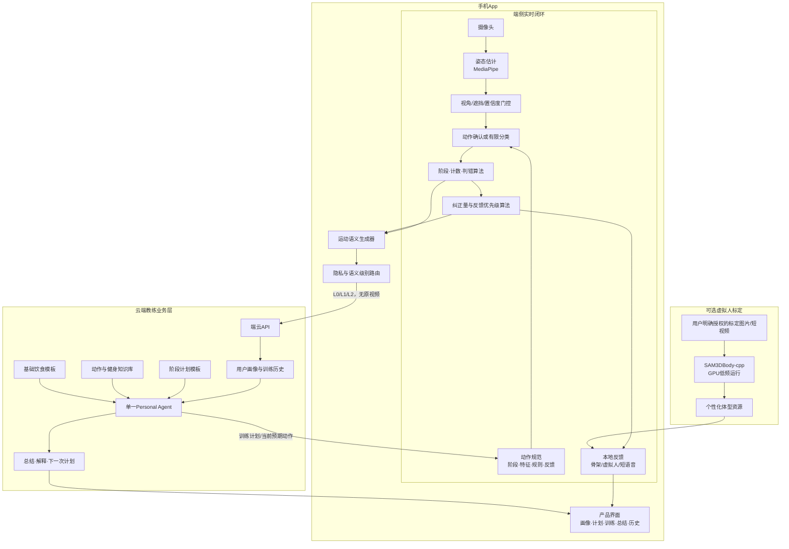

# AI健身教练融合架构 v2

> 状态：讨论稿，不代表最终定案  
> 日期：2026-09-30  
> 目的：融合《产品想法.md》和上一版技术架构，明确算法、App与Personal Agent的边界。

---

## 1. 产品定位

本项目不是单纯的“动作识别App”，而是一个能够长期陪伴用户训练的AI健身私教：

```text
了解用户
  → 制定阶段计划
  → 带领用户完成训练
  → 实时识别和纠正动作
  → 生成训练总结
  → 根据历史调整后续计划
```

其中最重要的技术前提是：

> **原始训练视频默认不离开手机；动作判断由端侧算法完成；Personal Agent根据结构化运动结果进行解释、记忆和规划。**

建议把项目的技术主线表述为：

> **面向健身任务的隐私保护端云协同Personal Agent。**

端侧保留实时性和视觉隐私，云端提供长期记忆、计划能力和自然语言交互。

---

## 2. 四条不可混淆的边界

### 2.1 算法回答“动作怎么样”

端侧算法负责：

- 人体关键点检测；
- 画面质量、遮挡和视角判断；
- 动作类型确认或有限分类；
- 动作阶段与次数；
- 关节角度和运动学特征；
- 错误类型、严重度、置信度；
- 纠正方向和虚拟人目标姿态；
- 组内动作质量变化。

### 2.2 Agent回答“怎么指导和以后怎么练”

Personal Agent负责：

- 把算法结果解释成自然语言；
- 组织热身、主训练、休息和拉伸；
- 根据历史表现调整训练计划；
- 记住长期存在和已经改善的问题；
- 回答用户的健身问题；
- 生成基础饮食建议；
- 在证据不足时明确说明不确定。

Agent不直接根据视频或几个坐标自由判断姿态是否正确。

### 2.3 App回答“用户如何完成整个流程”

App负责：

- 摄像头、麦克风、权限和网络；
- 端侧算法运行；
- 实时训练界面；
- 本地骨架或虚拟人显示；
- 用户画像、计划、总结、历史和激励页面；
- 语音播报和Agent对话；
- 隐私设置和数据删除。

### 2.4 数据接口回答“端云之间知道什么”

端云接口负责：

- 保证云端不需要原视频也能理解训练结果；
- 明确每个结论的时间、动作阶段、严重度和置信度；
- 限制云端只能获取用户允许的运动语义；
- 让所有模块使用同一种数据结构。

---

## 3. 总体架构



架构包含两个时间尺度：

| 闭环 | 典型响应时间 | 负责内容 |
|---|---:|---|
| 端侧实时闭环 | 约几十到几百毫秒 | 计数、判错、短提示、虚拟人 |
| 云端教练闭环 | 数秒到一次训练之后 | 解释、复盘、历史分析、计划调整 |

---

## 4. 用户完整流程

### 4.1 首次使用

1. 用户填写训练目标、经验、时间和器械条件。
2. 用户填写饮食偏好、过敏信息和主动报告的不适情况。
3. App说明：训练视频默认仅在本机处理。
4. App帮助用户完成一次站位和摄像头角度检查。
5. 用户选择是否启用个性化虚拟人体型标定。
6. Personal Agent根据阶段模板生成首周计划。

### 4.2 今日训练

```text
Agent介绍今日目标
    ↓
App加载第一个动作规范
    ↓
端侧确认用户开始了正确动作
    ↓
端侧算法计数和纠错
    ↓
Agent控制组数、休息和动作切换
    ↓
完成拉伸和训练总结
```

### 4.3 训练之后

- 本地立即显示次数、节奏和主要动作问题；
- 云端Agent根据运动语义生成训练总结；
- 历史模块更新错误趋势和完成情况；
- 阶段计划模板根据明确规则决定是否允许调整；
- Agent负责向用户解释调整原因。

---

## 5. 两种训练模式

### 5.1 计划训练模式：MVP主模式

Personal Agent已经知道当前计划动作，因此端侧只需要确认：

> 用户是否正在做计划要求的动作？

```json
{
  "mode": "planned",
  "expected_exercise": "squat",
  "detected_exercise": "squat",
  "confidence": 0.94,
  "status": "confirmed"
}
```

这种方式不需要在几十种运动中开放识别，可靠性更高。

### 5.2 自由训练模式：P1功能

用户可以直接开始训练，系统只在当前已经支持的动作集合中分类：

```text
深蹲 / 俯卧撑 / 其他或未知
```

- 置信度高：自动进入对应动作规范；
- 置信度中等：让用户确认；
- 置信度低或未知：提示当前动作暂不支持；
- 不宣称能够识别任意健身运动。

所谓“专项教练”是产品表现形式，不代表启动另一个大模型：

```text
同一个Personal Agent
    + 当前动作规范
    + 当前动作知识
    + 当前动作历史记录
    = 专项教练体验
```

---

## 6. 端侧实时算法

### 6.1 处理链路

```text
视频帧
  ↓
MediaPipe关键点
  ↓
时序滤波和异常点处理
  ↓
视角与可观测性判断
  ↓
动作阶段状态机
  ↓
运动学特征计算
  ↓
判据执行和连续帧聚合
  ↓
纠错事件与本地反馈
```

### 6.2 三类算法结果

#### 检测结果

- 当前动作；
- 当前阶段；
- 当前次数；
- 关键点和画面质量。

#### 判错结果

- 错误类型；
- 严重度；
- 置信度；
- 是否可观测；
- 发生时间和动作阶段。

#### 纠正结果

- 需要关注的关节；
- 建议调整方向；
- 对应目标角度或安全区间；
- 本次最高优先级问题；
- 虚拟人或箭头所需的数据。

### 6.3 不可观测状态

算法输出必须至少支持三种状态：

```text
正确 / 错误 / 当前不可判断
```

例如侧面摄像头不能可靠判断膝内扣时，系统应提示调整机位，不应将其判成正确。

---

## 7. 动作规范与共享引擎

不同动作不共享同一套判错规则，但共享同一个执行框架。

动作规范包含：

- 支持的摄像头视角；
- 所需关键点；
- 动作阶段定义；
- 每个阶段要计算的特征；
- 错误判据；
- 连续时间要求；
- 错误优先级；
- 对应的短提示和可视化方式。

示例：

```yaml
id: squat
views:
  front: [knee_valgus, symmetry]
  side: [depth, trunk_lean]

rules:
  - id: knee_valgus
    phase: [descending, bottom]
    view: front
    feature: normalized_knee_medial_offset
    threshold: 0.08
    min_confidence: 0.75
    hold_ms: 300
    priority: high
    feedback_code: OPEN_KNEES
```

MVP不必开发完整的动作语言编译器，可以先把深蹲和俯卧撑写成结构一致的配置和代码模块。

---

## 8. 运动语义与隐私

### 8.1 语义级别

| 级别 | 内容 | 主要用途 | 默认策略 |
|---|---|---|---|
| L0 | 组数、次数、节奏、总分、完成情况 | 历史记录和计划调整 | 上传并保存 |
| L1 | 错误事件、阶段、角度、严重度、置信度 | 总结和解释 | 用户允许后上传 |
| L2 | 根节点、方向和尺度归一化的短时骨架 | 连续动作分析 | 默认关闭，临时使用 |

MVP实现L0和L1即可；L2属于核心创新展示或后续功能。

### 8.2 语义路由

第一版使用确定性规则：

```text
正常完成一组 → L0

出现高置信度错误 → L0 + L1

问题依赖连续时序且用户允许 → 增加L2

关键点置信度不足 → 端侧重新检测或调整机位
                      不通过上传原视频解决
```

### 8.3 统一训练事件

```json
{
  "schema_version": "0.2",
  "session_id": "session_001",
  "mode": "planned",
  "exercise": "squat",
  "set_index": 2,
  "rep_index": 8,
  "phase": "bottom",
  "view": "front",
  "pose_confidence": 0.92,
  "events": [
    {
      "type": "knee_valgus",
      "severity": 0.64,
      "confidence": 0.89,
      "observable": true,
      "feedback_code": "OPEN_KNEES"
    }
  ]
}
```

该Schema取代URDF作为端云之间的业务数据格式。

---

## 9. 虚拟人方案

虚拟人分为“体型生成”和“实时驱动”两件事。

### 9.1 MVP方案

- 使用统一的低多边形人偶或2D骨架；
- MediaPipe关键点实时驱动；
- 错误关节标红；
- 箭头显示调整方向；
- 可叠加标准动作轨迹。

### 9.2 个性化体型方案：P1或展示实验

SAM3DBody-cpp只在首次标定或用户主动更新时低频运行：

```text
用户明确授权的标定图片/短视频
       ↓
SAM3DBody-cpp在CUDA设备运行
       ↓
提取稳定体型参数和个性化网格
       ↓
转换为App可加载的虚拟人资源
       ↓
日常仍由MediaPipe实时驱动
```

限制：

- 不在手机上逐帧运行SAM3DBody-cpp；
- 不把它作为动作正确性的唯一判断依据；
- 不承诺还原真实脸部、衣物和精确身体尺寸；
- 体型和骨架本身也属于敏感信息，应优先本地保存；
- 上游模型权重许可证需单独确认。

对外表述：

> 生成与用户主要身体比例近似的个性化虚拟替身。

不要表述为“与用户完全相同的数字人”。

---

## 10. Personal Agent设计

第一版只需要一个Personal Agent，通过工具和数据决定当前任务。

### 10.1 Agent可调用的工具

```text
get_user_profile()
get_today_plan()
get_current_session_summary()
get_error_events(exercise, time_range)
get_quality_trend(exercise, time_range)
get_exercise_spec(exercise)
get_plan_template(goal, stage)
update_next_plan(constrained_changes)
get_basic_nutrition_template(context)
```

### 10.2 Agent工作范围

| 场景 | Agent可以做 | Agent不能做 |
|---|---|---|
| 实时训练 | 组织动作、控制休息、解释算法结果 | 自己看视频算角度 |
| 训练总结 | 汇总错误、指出改善趋势 | 编造未检测到的问题 |
| 阶段计划 | 在模板约束下调整组数、次数和安排 | 自由生成高风险训练方案 |
| 用户不适 | 停止相关训练并建议寻求专业意见 | 做伤病诊断 |
| 饮食建议 | 给出日常、替换型基础建议 | 医疗营养治疗 |

### 10.3 组内动作质量衰减

系统可以观察：

- 后几次动作速度持续下降；
- 错误严重度逐次增加；
- 左右不对称持续扩大；
- 用户多次提前结束训练。

应称为“动作质量衰减”，不能仅凭视频直接宣称用户发生了生理疲劳。

---

## 11. 产品功能结构

### 首页

- 今日训练；
- 当前阶段；
- 最近一次总结；
- 连续训练；
- 开始AI带练。

### 用户画像

- 目标、基础和时间；
- 器械和场地；
- 用户主动填写的不适信息；
- 饮食偏好和过敏；
- 隐私级别和数据保存设置。

### 阶段计划

- 当前阶段和阶段目标；
- 本周安排；
- 每次训练内容；
- 计划调整及原因。

### AI实时带练

- 用户摄像头预览；
- 动作确认或有限识别；
- 次数、阶段和当前组；
- 骨架或虚拟人；
- 本地实时纠错；
- Agent语音组织；
- 暂停、结束和求助。

### 训练总结与历史

- 完成次数和节奏；
- 主要错误及发生阶段；
- 与历史相比的变化；
- 下一次建议；
- 周期趋势图。

### 基础饮食建议

- 今日训练前后建议；
- 食堂、外卖和家庭饮食替换；
- 过敏和忌口过滤；
- 明确非医疗建议。

### 激励

- 连续训练；
- 阶段完成；
- 动作改善徽章。

第一版不优先开发排行榜和复杂社交。

---

## 12. 团队职责

### A：端侧运动算法

- MediaPipe接入和关键点稳定；
- 动作确认或有限分类；
- 阶段、计数和判错；
- 视角、遮挡和置信度；
- 纠正方向和反馈码；
- L0/L1/L2运动语义输出。

### B：Personal Agent与业务服务

- Agent工具调用和对话；
- 阶段计划模板；
- 训练总结和长期历史；
- 基础饮食模板；
- 结构化数据到自然语言的转换。

### C：App运行基础与实时训练

- App工程；
- 摄像头和权限；
- 算法模块接入；
- 实时训练页面；
- 语音和网络；
- 打包、性能和异常处理。

### D：产品功能与体验

- 用户画像；
- 首页和计划；
- 总结和历史；
- 饮食、激励和教练形象；
- 隐私说明与授权流程。

### E：统筹、Schema与测试

- 冻结产品范围；
- 统一数据结构和接口版本；
- 明确隐私边界；
- 建立测试样本和验收指标；
- 联调和演示流程；
- 处理模块间职责冲突。

---

## 13. MVP范围

### 13.1 必须真实跑通

- 用户画像；
- 一个阶段计划模板；
- 计划训练模式；
- 深蹲和俯卧撑两个动作；
- 每个动作2至4个可靠判据；
- 次数、阶段、视角和置信度；
- 端侧即时反馈；
- L0/L1运动语义；
- Agent训练总结；
- 根据本次结果调整下一次计划的一个真实闭环；
- 一个基础饮食建议卡；
- 一个简单激励机制；
- 原始视频不上传。

### 13.2 可以使用模板或模拟数据

- 完整四阶段训练周期；
- 一周完整饮食计划；
- 更多动作；
- 长期数月趋势；
- 社交和排行榜。

### 13.3 暂不进入关键路径

- Video LLM逐帧分析；
- TeleAI视频重建；
- URDF；
- 多个独立LLM Agent；
- 手机端实时SAM3DBody-cpp；
- 照片级用户数字人；
- 任意运动开放识别；
- 医疗诊断和医疗级饮食建议；
- 全面反作弊系统。

---

## 14. 需要验证的指标

### 算法

- 动作计数准确率；
- 每种错误的Precision、Recall和F1；
- 误报率和“不可判断”比例；
- 正面、侧面、遮挡条件下分别评测；
- 端侧帧率与反馈延迟。

### 端云与隐私

- L0/L1相对原视频的数据量；
- 云端是否能在无原视频条件下完成总结和计划调整；
- 云端保存的数据是否包含人脸、背景和衣着；
- 用户能否查看并删除历史记录。

### Agent

- 每条总结能否追溯到结构化运动事件；
- 计划调整是否说明原因；
- 无证据时是否拒绝编造；
- 是否遵守用户隐私和健康安全边界。

### 产品闭环

- 用户是否能从画像开始完成一次完整训练；
- 训练结果是否真正影响下一次计划；
- 网络中断时端侧纠错能否继续工作。

---

## 15. 建议演示流程

1. 展示用户画像和AI生成的适应期计划。
2. 用户点击“开始AI带练”，Agent介绍今日目标。
3. 系统加载深蹲规范并确认用户开始深蹲。
4. 用户先完成几次正确动作，系统正常计数。
5. 用户主动演示一个预设错误，端侧立即提示并在骨架上标红。
6. 关闭网络或展示网络状态，证明实时纠错仍可继续。
7. 训练结束后，只上传L0/L1语义。
8. Agent生成可追溯的训练总结。
9. 下一次计划根据后程动作质量下降减少两次或延长休息。
10. 展示云端没有原视频、只有结构化运动记录。

如果个性化虚拟人稳定，再额外展示SAM3DBody标定结果；不要让该模块影响主流程演示。

---

## 16. 当前需要团队决定的七件事

1. 主打“隐私端云协同”，还是主打“完整AI私教产品”；建议前者是技术主线，后者是产品包装。
2. MVP是否只做计划训练模式；建议是。
3. 动作选择是深蹲＋俯卧撑，还是加入第三个动作。
4. 每个动作首版只支持一个主要视角，还是同时做正面和侧面。
5. L1错误事件是否默认允许上传，L2骨架是否默认关闭。
6. 虚拟人首版采用2D骨架、统一3D人偶，还是投入时间做SAM3DBody标定。
7. 饮食模块只做一张训练相关卡片，还是占用开发时间做完整页面。

在这七项确定之前，不建议继续增加模型或Agent数量。
