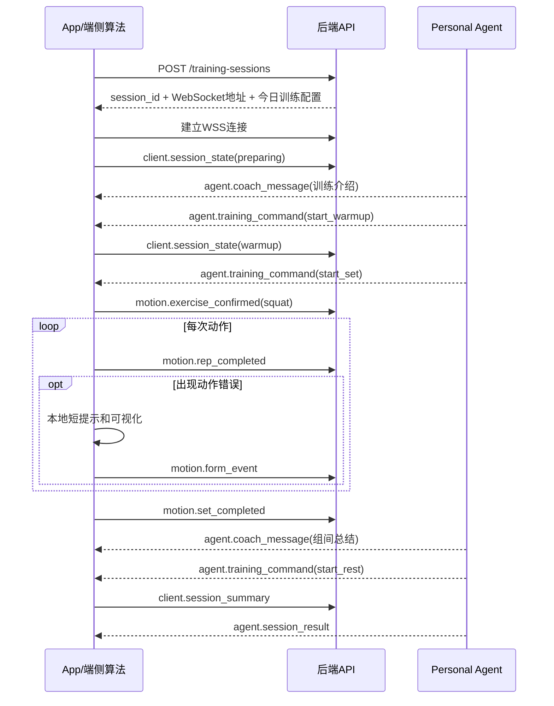

# AI健身教练前后端通信协议 v0.1

> 状态：联调讨论稿  
> 日期：2026-09-30  
> 适用范围：App前端、端侧视觉算法与云端Agent业务层之间的通信  
> 已确认前提：**视觉识别算法运行在前端，原始视频不上云。**

---

## 1. 协议目标

本协议不改变现有产品架构中的用户画像、专项教练、阶段规划、饮食规划和长期训练记录，只解决以下问题：

1. 前端视觉算法应向云端Agent提供哪些信息；
2. 云端Agent应怎样向App发送教练消息和训练控制指令；
3. 如何保证原始视频不上传；
4. 如何区分算法判断、Agent解释与App执行；
5. 网络中断、重复消息和版本变化时如何处理。

协议的基本原则是：

> **前端上传“动作事实”，Agent下发“指导与计划”。**

```text
手机摄像头
    ↓ 原始画面仅在本地内存中处理
前端视觉算法
    ↓ 动作类型、阶段、次数、错误、置信度、训练摘要
云端Agent业务层
    ↓ 教练话术、休息指令、计划调整、训练总结
App界面与本地语音
```

---

## 2. 职责边界

| 模块 | 负责 | 不负责 |
|---|---|---|
| 前端视觉算法 | 关键点、动作识别、阶段、计数、角度、判错、纠正方向、置信度 | 生成长期计划、饮食建议、开放式聊天 |
| App业务层 | 摄像头、权限、会话状态、界面、本地反馈、数据授权 | 自行修改算法结论、绕过隐私设置上传视频 |
| 云端Agent | 专项路由、教练表达、训练组织、总结、历史分析、计划与饮食建议 | 直接看视频算角度、覆盖算法的不可观测结论 |
| 后端数据层 | 用户画像、计划、训练记录、消息持久化 | 保存协议禁止上传的原始视觉数据 |

“Coach Agent负责动作纠错”在接口层应解释为：

> Coach Agent接收前端算法已经生成的纠错事件，将其转化为合适的教练语言，并结合训练上下文决定何时说、说什么以及下一步怎么安排。

---

## 3. 传输方式

建议采用HTTP与WebSocket组合。

### 3.1 HTTP API

适合低频、需要可靠结果的请求：

- 获取用户画像；
- 获取今日计划；
- 创建训练会话；
- 提交最终训练总结；
- 获取历史记录；
- 获取阶段计划和饮食建议。

建议路径：

```text
GET  /api/v1/users/me/profile
GET  /api/v1/plans/today
POST /api/v1/training-sessions
POST /api/v1/training-sessions/{session_id}/complete
GET  /api/v1/training-sessions/{session_id}
GET  /api/v1/progress/summary
```

### 3.2 WebSocket

适合训练过程中的双向实时消息：

```text
WSS /api/v1/training-sessions/{session_id}/stream
```

上传内容是结构化动作事件，不是视频流。

### 3.3 安全要求

- 生产或正式演示环境必须使用HTTPS/WSS；
- 大模型API Key只能保存在后端，不能写入发布版App；
- App使用短期会话Token连接后端；
- 后端不能通过任何下行指令临时打开视频上传；
- 日志不得记录完整认证Token和敏感用户信息。

---

## 4. 公共消息信封

所有WebSocket消息使用统一外层结构：

```json
{
  "protocol_version": "0.1",
  "message_id": "msg_01HXYZ...",
  "type": "motion.form_event",
  "session_id": "session_001",
  "sequence": 128,
  "client_time_ms": 1790739245123,
  "session_offset_ms": 12480,
  "requires_ack": false,
  "payload": {}
}
```

字段说明：

| 字段 | 类型 | 必填 | 含义 |
|---|---|---:|---|
| `protocol_version` | string | 是 | 协议版本，当前为`0.1` |
| `message_id` | string | 是 | 全局唯一消息ID，用于去重 |
| `type` | string | 是 | 消息类型 |
| `session_id` | string | 是 | 当前训练会话ID |
| `sequence` | integer | 是 | 当前发送方在本会话内单调递增的序号 |
| `client_time_ms` | integer | 是 | 客户端Unix毫秒时间戳 |
| `session_offset_ms` | integer | 是 | 相对训练开始时间，便于时间线对齐 |
| `requires_ack` | boolean | 是 | 是否要求对方显式确认 |
| `payload` | object | 是 | 具体业务数据 |

约定：

- JSON编码使用UTF-8；
- 字段名统一使用`snake_case`；
- 置信度和严重度统一在`0.0～1.0`之间；
- 角度统一使用`degree`；
- 时间长度统一使用`ms`或`seconds`，必须写明单位；
- 不得发送`NaN`和`Infinity`；
- 未获得的数据省略，不用虚假的`0`代替。

---

## 5. 隐私级别

会话创建时由前端声明允许上传的最高运动数据级别。

| 级别 | 名称 | 内容 | 默认 |
|---|---|---|---:|
| L0 | `summary` | 次数、组数、节奏、总体错误统计 | 否 |
| L1 | `events` | L0＋具体错误事件、角度、阶段、置信度 | 是 |
| L2 | `normalized_skeleton` | L1＋去位置、去尺度后的短时骨架序列 | 否，需单独授权 |

会话隐私声明示例：

```json
{
  "motion_data_level": "events",
  "allow_raw_video_upload": false,
  "allow_normalized_skeleton": false,
  "retain_event_days": 30
}
```

### 5.1 永久禁止通过本协议上传的内容

- 摄像头RGB、YUV或其他原始帧；
- 视频文件或视频分片；
- 原始帧的Base64编码；
- 人脸裁剪图；
- 房间和背景图像；
- 以“调试附件”为名携带的截图；
- 可还原原始画面的视觉Token。

`allow_raw_video_upload`在当前版本必须恒为`false`，服务端无权修改。

### 5.2 语音数据

用户与Agent的语音交互不属于运动视觉协议：

- 优先在前端转写为文字后上传；
- 如必须使用云端语音识别，应独立授权并使用单独接口；
- 不允许把麦克风音频混入运动事件消息。

### 5.3 虚拟人体型标定

SAM3DBody或其他体型重建属于独立、低频、显式授权的流程，不得复用实时训练WebSocket偷偷上传图片或视频。MVP可以完全不开放该上传接口。

---

## 6. 会话生命周期

统一状态机：

```text
created
   ↓
preparing
   ↓
warmup
   ↓
active_set ↔ resting
   ↓
cooldown
   ↓
completed

任意训练状态 → paused / aborted
```

状态变化由App执行并上报。Agent可以提出训练指令，但App必须验证当前状态是否合法。

例如：

- `active_set`状态可以接收`pause`或`finish_set`；
- `resting`状态不能直接增加动作计数；
- 已经`completed`的会话不得重新进入`active_set`；
- 网络断开时，端侧算法和本地纠错继续运行。

---

## 7. 创建训练会话

### 7.1 请求

```http
POST /api/v1/training-sessions
```

```json
{
  "plan_item_id": "plan_20260930_01",
  "training_mode": "planned",
  "expected_exercise": "squat",
  "client": {
    "app_version": "0.1.0",
    "platform": "android",
    "pose_engine": "mediapipe_blazepose",
    "pose_engine_version": "0.10.x",
    "algorithm_version": "motion_rules_0.1",
    "exercise_spec_version": "squat_0.1"
  },
  "capabilities": {
    "supports_local_tts": true,
    "supports_avatar": false,
    "supported_exercises": ["squat", "push_up"]
  },
  "privacy_policy": {
    "motion_data_level": "events",
    "allow_raw_video_upload": false,
    "allow_normalized_skeleton": false
  }
}
```

### 7.2 响应

```json
{
  "session_id": "session_001",
  "websocket_url": "wss://example.com/api/v1/training-sessions/session_001/stream",
  "stream_token": "short_lived_token",
  "session_config": {
    "mode": "planned",
    "expected_exercise": "squat",
    "target_sets": 3,
    "target_reps": 10,
    "rest_seconds": 45,
    "allowed_exercises": ["squat"]
  },
  "coach": {
    "display_name": "AI私教",
    "specialist_label": "深蹲专项指导"
  }
}
```

计划训练模式下，`allowed_exercises`应尽量小。自由训练模式可以包含当前系统真实支持的动作集合。

---

## 8. 前端发送给后端的实时消息

### 8.1 `client.session_state`

表示App训练状态变化，需要确认。

```json
{
  "type": "client.session_state",
  "requires_ack": true,
  "payload": {
    "previous_state": "warmup",
    "current_state": "active_set",
    "exercise_id": "squat",
    "set_index": 1,
    "reason": "user_started"
  }
}
```

### 8.2 `motion.exercise_state`

周期性低频状态，建议最多每秒1～2条，不得按照摄像头帧率上传。

```json
{
  "type": "motion.exercise_state",
  "requires_ack": false,
  "payload": {
    "mode": "planned",
    "expected_exercise": "squat",
    "detected_exercise": "squat",
    "detection_confidence": 0.94,
    "candidate_exercises": [
      {"exercise_id": "squat", "confidence": 0.94},
      {"exercise_id": "lunge", "confidence": 0.04}
    ],
    "phase": "descending",
    "set_index": 1,
    "rep_index": 4,
    "view": "front",
    "observability": "observable",
    "pose_confidence": 0.92
  }
}
```

`observability`枚举：

```text
observable
partially_observable
not_observable
```

如果为`not_observable`，Agent不得把“未检测到错误”解释为“动作正确”。

### 8.3 `motion.exercise_confirmed`

动作由端侧确认后发送。自由训练模式下，后端据此加载专项教练上下文。

```json
{
  "type": "motion.exercise_confirmed",
  "requires_ack": true,
  "payload": {
    "exercise_id": "squat",
    "confidence": 0.94,
    "confirmation_method": "planned_match",
    "candidate_exercises": [
      {"exercise_id": "squat", "confidence": 0.94},
      {"exercise_id": "lunge", "confidence": 0.04}
    ]
  }
}
```

`confirmation_method`枚举：

```text
planned_match
automatic_high_confidence
user_confirmed
```

### 8.4 `motion.rep_completed`

每完成一次动作发送一条，而不是上传该动作的全部帧。

```json
{
  "type": "motion.rep_completed",
  "requires_ack": false,
  "payload": {
    "exercise_id": "squat",
    "set_index": 1,
    "rep_index": 4,
    "duration_ms": 2840,
    "phase_durations_ms": {
      "descending": 1080,
      "bottom": 240,
      "ascending": 1520
    },
    "quality_score": 82,
    "score_version": "squat_score_0.1",
    "dominant_error_code": "squat.knee_valgus",
    "error_count": 1,
    "pose_confidence": 0.91
  }
}
```

如果评分方法尚未验证，可以省略`quality_score`，不得为了界面效果伪造精确分数。

### 8.5 `motion.form_event`

表示一个动作错误的开始、更新或结束。前端应进行连续帧聚合，避免每帧发送相同错误。

```json
{
  "type": "motion.form_event",
  "requires_ack": false,
  "payload": {
    "event_id": "event_knee_001",
    "event_action": "start",
    "exercise_id": "squat",
    "error_code": "squat.knee_valgus",
    "phase": "bottom",
    "side": "left",
    "severity": 0.64,
    "confidence": 0.89,
    "observable": true,
    "evidence_window_ms": {
      "start": 12100,
      "end": 12700
    },
    "metrics": [
      {
        "metric_id": "normalized_knee_medial_offset",
        "value": 0.11,
        "unit": "shoulder_width_ratio",
        "threshold": 0.08
      }
    ],
    "correction": {
      "joint": "left_knee",
      "direction": "outward",
      "feedback_code": "OPEN_LEFT_KNEE"
    }
  }
}
```

`event_action`枚举：

```text
start
update
end
```

MVP可以只实现`start`和`end`。

### 错误码命名

错误码使用“动作.错误”的稳定格式：

```text
squat.knee_valgus
squat.insufficient_depth
squat.excessive_trunk_lean
squat.left_right_asymmetry
push_up.hip_sag
push_up.hip_pike
push_up.insufficient_depth
push_up.elbow_flare
```

后端Agent只能解释已经登记的错误码。未知错误码应显示通用提示并写入日志，不能由LLM猜测含义。

### 8.6 `motion.set_completed`

```json
{
  "type": "motion.set_completed",
  "requires_ack": true,
  "payload": {
    "exercise_id": "squat",
    "set_index": 1,
    "completed_reps": 10,
    "target_reps": 10,
    "set_duration_ms": 46200,
    "average_rep_duration_ms": 2910,
    "average_quality_score": 80,
    "quality_trend": "declining_late_set",
    "error_summary": [
      {
        "error_code": "squat.knee_valgus",
        "affected_reps": [8, 9, 10],
        "max_severity": 0.68,
        "average_confidence": 0.90
      }
    ]
  }
}
```

`quality_trend`推荐枚举：

```text
stable
improving
declining_late_set
inconclusive
```

该字段表示可观察到的动作质量变化，不等同于生理疲劳诊断。

### 8.7 `client.user_report`

用户主动反馈疼痛、疲劳感受或训练难度。用户报告与视觉算法推断必须分开保存。

```json
{
  "type": "client.user_report",
  "requires_ack": true,
  "payload": {
    "report_type": "pain",
    "body_region": "right_knee",
    "intensity": 4,
    "text": "下蹲时右膝有点不舒服",
    "source": "user_input"
  }
}
```

建议枚举：

```text
pain
perceived_exertion
dizziness
request_easier
request_harder
other
```

出现疼痛、眩晕等用户报告时，App应先本地暂停训练，再等待Agent给出安全提示。

### 8.8 `motion.skeleton_window`

仅在用户允许L2时使用。MVP可以不实现。

```json
{
  "type": "motion.skeleton_window",
  "requires_ack": false,
  "payload": {
    "event_id": "event_knee_001",
    "exercise_id": "squat",
    "coordinate_system": "hip_centered_body_frame",
    "scale_normalization": "shoulder_width",
    "fps": 10,
    "joint_schema": "fitness_core_15_v1",
    "joints": ["left_hip", "left_knee", "left_ankle"],
    "frames": [
      {
        "offset_ms": 0,
        "values": [[-0.18, 0.12, 0.02, 0.94], [-0.15, 0.54, 0.04, 0.92], [-0.17, 0.88, 0.01, 0.90]]
      }
    ],
    "retention": "transient"
  }
}
```

每个关节值依次为`[x, y, z, confidence]`。不得包含脸部、房间坐标或用于还原原视频的特征。

### 8.9 `client.session_summary`

训练结束时发送完整摘要。它是后端生成总结和调整计划的主要输入。

```json
{
  "type": "client.session_summary",
  "requires_ack": true,
  "payload": {
    "started_at_ms": 1790739000000,
    "ended_at_ms": 1790740800000,
    "duration_seconds": 1800,
    "completion_status": "completed",
    "exercises": [
      {
        "exercise_id": "squat",
        "completed_sets": 3,
        "completed_reps": 28,
        "target_reps": 30,
        "average_rep_duration_ms": 2860,
        "quality_trend": "declining_late_set",
        "error_summary": [
          {
            "error_code": "squat.knee_valgus",
            "occurrences": 6,
            "max_severity": 0.68,
            "average_confidence": 0.90
          }
        ]
      }
    ],
    "user_reports": [
      {
        "report_type": "perceived_exertion",
        "intensity": 7
      }
    ],
    "algorithm_version": "motion_rules_0.1",
    "exercise_spec_versions": {
      "squat": "squat_0.1"
    }
  }
}
```

---

## 9. 后端发送给前端的实时消息

### 9.1 `server.ack`

```json
{
  "type": "server.ack",
  "payload": {
    "ack_message_id": "msg_01HXYZ...",
    "status": "accepted"
  }
}
```

`status`枚举：

```text
accepted
duplicate
rejected
```

### 9.2 `agent.exercise_route`

后端根据已确认动作加载专项教练上下文。这里的“专项教练”可以是同一个LLM配合不同Prompt、动作知识和工具。

```json
{
  "type": "agent.exercise_route",
  "payload": {
    "exercise_id": "squat",
    "route": "exercise_coach",
    "specialist_label": "深蹲专项指导",
    "exercise_spec_id": "squat_0.1",
    "reason": "planned_match"
  }
}
```

注意：动作判据仍由前端算法执行。`exercise_spec_id`用于检查双方版本是否一致，不要求Agent重新运行判错算法。

### 9.3 `agent.coach_message`

用于训练组织、解释和较长反馈。高频短提示由前端根据`feedback_code`本地播放。

```json
{
  "type": "agent.coach_message",
  "payload": {
    "message_id": "coach_001",
    "priority": "normal",
    "category": "form_explanation",
    "text": "刚才后半组左膝向内偏移更明显。下一组先减慢速度，并让膝盖方向跟随脚尖。",
    "speech_text": "下一组先减慢速度，注意让膝盖跟随脚尖。",
    "related_event_ids": ["event_knee_001"],
    "display_duration_ms": 6000
  }
}
```

`priority`枚举：

```text
low
normal
high
safety
```

Agent消息必须能通过`related_event_ids`追溯到算法事件；纯训练组织消息可以为空。

### 9.4 `agent.training_command`

用于控制训练流程，不用于直接控制摄像头或视觉算法隐私设置。

```json
{
  "type": "agent.training_command",
  "requires_ack": true,
  "payload": {
    "command": "start_rest",
    "reason": "set_completed",
    "parameters": {
      "duration_seconds": 45
    }
  }
}
```

建议命令枚举：

```text
start_warmup
start_set
finish_set
start_rest
next_exercise
adjust_target_reps
pause
resume
start_cooldown
finish_session
stop_for_safety
```

App收到命令后必须检查当前状态是否合法。Agent不能通过命令修改：

- 摄像头上传策略；
- 隐私级别；
- 算法阈值；
- 算法已经输出的错误类型和置信度。

### 9.5 `agent.context_request`

当Agent认为当前结构化信息不足时，可以请求允许范围内的更多结构化信息。

```json
{
  "type": "agent.context_request",
  "requires_ack": true,
  "payload": {
    "request_id": "context_001",
    "related_event_id": "event_knee_001",
    "requested_level": "normalized_skeleton",
    "requested_fields": ["hip_knee_ankle_window"],
    "reason": "temporal_pattern_analysis",
    "max_duration_ms": 2000
  }
}
```

前端处理规则：

```text
请求级别 ≤ 用户授权级别，并且本地缓存仍存在
    → 可以返回相应结构化数据

请求级别 > 用户授权级别
    → 返回 client.context_denied

请求包含原始图片、视频或未登记字段
    → 必须拒绝
```

拒绝示例：

```json
{
  "type": "client.context_denied",
  "payload": {
    "request_id": "context_001",
    "reason": "privacy_level_not_granted"
  }
}
```

### 9.6 `agent.session_result`

```json
{
  "type": "agent.session_result",
  "payload": {
    "summary": "今天完成了3组深蹲，共28次。主要问题出现在后两组末段，左膝内扣次数有所增加。",
    "highlights": [
      "前两组动作节奏稳定",
      "第8次以后动作质量下降"
    ],
    "next_session_changes": [
      {
        "field": "squat.target_reps",
        "previous_value": 10,
        "new_value": 8,
        "reason": "late_set_quality_decline"
      }
    ],
    "safety_note": null
  }
}
```

---

## 10. 错误响应

```json
{
  "type": "server.error",
  "payload": {
    "code": "UNSUPPORTED_EXERCISE_SPEC",
    "message": "服务端不支持客户端声明的动作规范版本",
    "retryable": false,
    "related_message_id": "msg_01HXYZ..."
  }
}
```

建议错误码：

| 错误码 | 含义 | 前端处理 |
|---|---|---|
| `INVALID_MESSAGE` | JSON或必填字段错误 | 记录日志，不重试同一消息 |
| `UNSUPPORTED_PROTOCOL_VERSION` | 协议版本不兼容 | 结束云端连接，保留本地训练 |
| `UNSUPPORTED_EXERCISE` | 后端不支持该动作 | 使用本地指导或提示用户 |
| `UNSUPPORTED_EXERCISE_SPEC` | 动作规范版本不一致 | 降级为训练摘要模式 |
| `PRIVACY_POLICY_VIOLATION` | 消息超出授权范围 | 立即停止该类上传 |
| `RATE_LIMITED` | 消息频率过高 | 降低状态发送频率 |
| `SESSION_STATE_CONFLICT` | 会话状态不合法 | 向服务端同步当前状态 |
| `AGENT_UNAVAILABLE` | Agent暂时不可用 | 继续端侧纠错，稍后提交总结 |

---

## 11. 断网、重连和去重

### 11.1 断网原则

断网时必须仍可运行：

- 姿态估计；
- 动作计数；
- 本地规则判错；
- 本地短提示；
- 暂停和结束训练。

不可用或延迟的功能：

- Agent自然语言解释；
- 云端训练计划更新；
- 云端历史同步；
- 云端饮食建议。

### 11.2 本地缓存

- 缓存L0训练摘要和尚未确认的重要事件；
- 不因断网而缓存原始视频；
- 恢复连接后优先发送`set_completed`和`session_summary`；
- 不必补发所有过期的`exercise_state`消息。

### 11.3 去重

- 后端按`message_id`去重；
- `requires_ack=true`的消息超时后可以使用相同`message_id`重发；
- 后端收到重复消息返回`duplicate`，不得重复修改训练计划；
- `sequence`用于发现丢包和乱序，但不能单独作为去重依据。

---

## 12. 消息频率和优先级

| 消息 | 建议频率 | 优先级 |
|---|---:|---:|
| `motion.exercise_state` | 1～2 Hz | 低 |
| `motion.rep_completed` | 每次动作1条 | 中 |
| `motion.form_event` | 错误开始/结束时 | 高 |
| `motion.set_completed` | 每组1条 | 高 |
| `client.user_report` | 用户触发 | 最高 |
| `client.session_summary` | 训练结束1条 | 最高 |
| `motion.skeleton_window` | 按需、短片段 | 中 |

拥塞时的丢弃顺序：

```text
优先丢弃旧的exercise_state
    ↓
保留rep_completed
    ↓
保留form_event和set_completed
    ↓
永不主动丢弃用户安全报告和session_summary
```

---

## 13. 前端本地即时反馈码

为避免等待Agent响应，常见错误由前端根据`feedback_code`直接播放短提示。

| `feedback_code` | 建议短提示 |
|---|---|
| `OPEN_LEFT_KNEE` | 左膝向外打开一些 |
| `OPEN_RIGHT_KNEE` | 右膝向外打开一些 |
| `KEEP_BODY_STRAIGHT` | 保持身体成一条直线 |
| `LOWER_HIPS` | 髋部稍微降低 |
| `REDUCE_SPEED` | 放慢动作速度 |
| `ADJUST_CAMERA_FRONT` | 请将手机调整到正面 |
| `ADJUST_CAMERA_SIDE` | 请将手机调整到侧面 |
| `FULL_BODY_NOT_VISIBLE` | 请后退，让全身进入画面 |

前端短提示和Agent长解释不能同时抢占语音。建议规则：

- `safety`消息可中断其他语音；
- 本地短提示优先于普通Agent解释；
- 同一错误短时间内设置冷却时间，避免反复播报；
- Agent解释尽量安排在动作间隔或组间休息时。

---

## 14. 会话时序示例



---

## 15. MVP最小实现集合

为了尽快联调，v0.1只要求实现以下内容。

### 前端必须发送

```text
client.session_state
motion.exercise_confirmed
motion.rep_completed
motion.form_event
motion.set_completed
client.user_report
client.session_summary
```

### 后端必须发送

```text
server.ack
server.error
agent.exercise_route
agent.coach_message
agent.training_command
agent.session_result
```

### v0.1可以不实现

```text
motion.exercise_state持续推送
motion.skeleton_window
agent.context_request
SAM3DBody体型标定上传
云端语音流
复杂排行榜和社交消息
```

建议先使用假数据打通WebSocket和完整会话状态机，再接入真实视觉算法。

---

## 16. 联调验收清单

- [ ] 前端关闭网络后仍能计数和给出本地纠错；
- [ ] 网络消息中不存在图片、视频或视觉Token；
- [ ] 后端能根据`motion.form_event`生成对应解释；
- [ ] 同一错误不会按照摄像头帧率重复上传；
- [ ] 后端能识别重复`message_id`；
- [ ] 动作规范版本不一致时能够安全降级；
- [ ] `not_observable`不会被解释为动作正确；
- [ ] 用户报告疼痛时，前端立即暂停；
- [ ] Agent不能通过命令修改隐私级别和算法阈值；
- [ ] 训练结束摘要能够驱动一次真实的下次计划调整；
- [ ] 用户可以查看和删除云端训练记录；
- [ ] 大模型API Key没有写入App安装包。

---

## 17. 双方需要冻结的字段

正式联调前，前端组与Agent组必须共同确认：

1. `exercise_id`列表；
2. 每个动作的`phase`列表；
3. 每个动作的`error_code`列表；
4. `feedback_code`列表；
5. 严重度和置信度的计算含义；
6. 是否在MVP中传输`quality_score`；
7. WebSocket实际地址和鉴权方式；
8. 默认隐私级别和保存天数；
9. 断网重连和ACK超时时间；
10. Agent允许下发的`training_command`列表。

其中前四项应当形成单独的共享枚举文件，由统筹人员维护版本，前后端均不得私自新增同名不同义的字段。

---

## 18. 一句话接口约定

> **前端只上传从视频中计算出的动作事实，不上传视频；Agent只基于这些事实提供教练表达和训练决策，不重新猜测姿态。**

